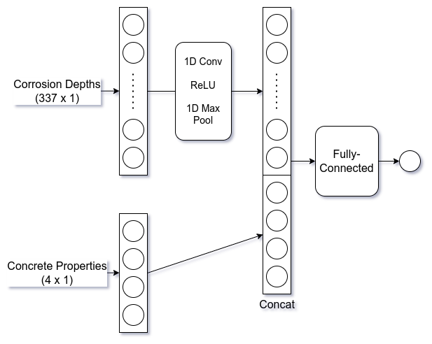

# 1-layer Convolution + 1 layer FC Model

This trains a model to predict concrete cracking based on corrosion depths measured on a concrete rebar, along with 4 continuous features representing properties of the concrete (rebar, cover, tensile_strength, and water_content). Corrosion is measured along the horizontal axis of the rebar, and is averaged along the circumference of the cross section, resulting in a 1d vector of floating point values.

For each training example, the corrosion depth input is given as a (337 x 1) vector, and the concrete properties are given as a (4 x 1) vector. The target label is a binary label in [0, 1].

The model first passes the corrosion inputs through a 1d convolution with 1 kernel of size 20, followed by a ReLU and max pooling layer with kernel size 16. This reduces the (337 x 1) input vector to a (19 x 1) vector. This is concatenated with the (4 x 1) vector of concrete properties, and the result is passed into a fully-connected layer which outputs a scalar. Finally, a sigmoid activation is applied to get the result.

The following is a graphical representation of this model:



## Usage
```
python3 train.py --corrosion_path=/path/to/corrosion.npy \
--label_path=/path/to/target_labels.npy --batch_size=512 --num_epochs=10000 \
--output_path=/path/to/model.pt
```
